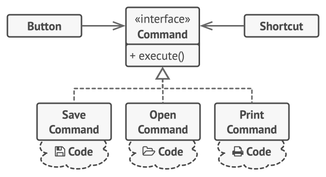
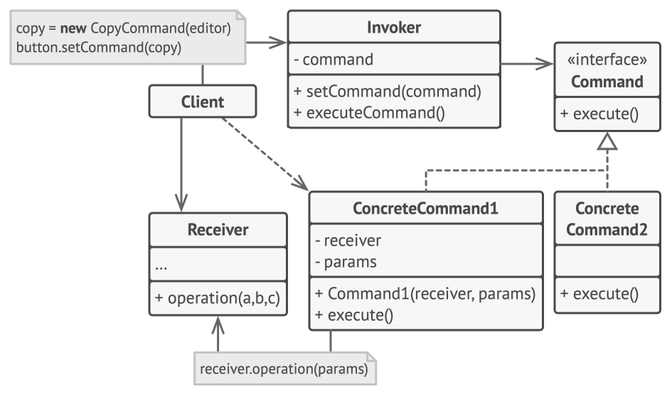
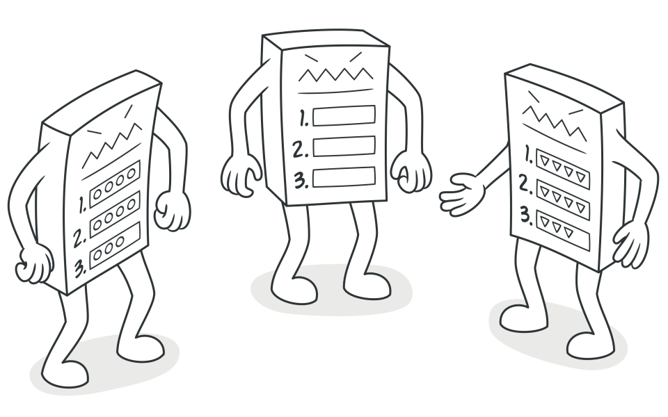

# Behavioural Design Pattern

##  1. Memento Design Pattern

The Memento Design Pattern is a behavioral design pattern used to save and restore an object’s previous state without violating **encapsulation** and **Single Responsibility Principle (SRP)**.

Example: Text Editor's Undo Functionallity

- BAD Code example:
    ```java

    public class TextEditor {
        private String content;

        public void write(String text) {
            this.content = text;
        }

        public String getContent() {
            return this.content;
        }
    }


    /**
     * Here If we introduce feature of state management then it will voilate SRP
     * As state management is not the responsibility of our TextEditor
     * 
     */

    ```

### How Memento Design Pattern Help here?

#### Components of Memento Design Patern
- **Originator**: The object whose state need to be saved.
- **Memento**: Captures and stores the internal state of the originator.
- **Caretaker**: Manages and stores the mementos without modifying them.

### Implementation of Undo in Text Editor Using Memento Design Pattern

#### TextEditor Class
This is our **originator**.
```java
public class TextEditor {
    private String content;

    public void write(String text) {
        this.content = text;
    }

    public String getContent() {
        return this.content;
    }
    public EditorMomento save() {
        return new EditorMomento(content);
    }

    public void restore(EditorMomento momento) {
        this.content = momento.getContent();
    }
}
```

#### EditorMemento Class

```java
public class EditorMomento {
    private final String content;

    public EditorMomento(String content) {
        this.content = content;
    }

    public String getContent() {
        return this.content;
    }
}

```

#### Caretacker Class [History Class]
It stores and manages the internal states of TextEditor class.
```java
public class History {
    private final Stack<EditorMomento> history = new Stack<>();

    public void saveState(TextEditor editor) {
        history.push(editor.save());
    }

    public void undo(TextEditor editor) {
        if(!history.isEmpty()) {
            history.pop();
            editor.restore(history.peek());
        }
    }
}
```

#### Driver Class [Main Class]

```java
public class TextEditorMain {
    public static void main(String[] args) {
        TextEditor editor = new TextEditor();
        History history = new History();

        editor.write("Hello WOrld");

        history.saveState(editor);

        editor.write("Hello All");
        history.saveState(editor);

        System.out.println(editor.getContent());

        history.undo(editor);
        System.out.println(editor.getContent());
    }
}
```

## 2. Observer Design Pattern
#### AKA -> PUB - SUB Design Pattern

The Observer design pattern is a behavioral design pattern that establishes a one-to-many dependency, allowing objects (Observers/subscribers) to automatically receive notifications and updates when another object (Subject/publisher/observable) changes its state, promoting loose coupling and efficient event handling without constant polling

### Example:
Let's say we have a weather station in the city and we need to transmit the weather data to all the people having certain type of device. In this case **Observer Design Pattern** will come into picture.


### Code Example

#### We have following components here for Weather Station System
- **Weather Station**: Has sensor for tamprature and transmit the data to all the devices that has subscribed to it.
- **Device**: Devices are responsible for displaying the info sent by Weather Station.

```
<<Subject>> [Interface]
Weather station will implements Subject

<<Device>> [Interface]
Mobile, Display, Tab will implement Device
```

```java
public interface Subject {
    void attach(Device o);
    void detach(Device o);
    void notifyUpdate(String message);
}
```

```java
public class WeatherStation implements Subject {

    List<Device> devices = new ArrayList<>();

    @Override
    public void attach(Device o) {
        devices.add(o);
    }

    @Override
    public void detach(Device o) {
        devices.remove(o);
    }

    @Override
    public void notifyUpdate(String message) {
        for(Device d: devices) {
            d.displayMessage(message);
        }
    }    
}
```

```java
public interface Device {
    public void displayMessage(String message);
}
```

```java
public class Mobile implements Device{

    @Override
    public void displayMessage(String message) {
        System.out.println("Mobile -> " + message);
    }
}
```

```java
public class Screen implements Device{

    @Override
    public void displayMessage(String message) {
        System.out.println("SCREEN -> " + message);
    }
}
```

```java
public class Main {
    public static void main(String[] args) {
        WeatherStation station = new WeatherStation();

        Mobile mobile = new Mobile();

        station.attach(mobile);
        station.attach(new Screen());

        station.notifyUpdate("Update 1");

        station.detach(mobile);

        station.notifyUpdate("Update 2");
    }
}
```

### Benifits of Observer Design Pattern:
1. **Loose Coupling**: Weather station do not need to know about the observer class it just notify all.
2. **Scalability**: New Observers can be added with minimum effors Open close principle.
3. **Flexibility**: We can add and remove observers dynamically.


### Observer Design Pattern Use Cases:
1. Event Listener.
2. Stock Price Monitoring.
3. News Publishing system.
4. Social Media Notification.
5. Looging System.

## Strategy Design Pattern

Lets understand with an example of a **Payment Service**.
In our Payment Service we have option of paying via multiple channels like Credit Card, Debit Card, UPI etc.
If we simply want to implement the system then the system will look like:

```java
public class PaymentSystem {
    public void makePayment(String paymentMethod) {
        if(paymentMethod.equals("CREDIT_CARD")) {
            System.out.println("Making Payment By Credit Card");
        }
        else if(paymentMethod.equals("DEBIT_CARD")) {
            System.out.println("Making payment via Debit Card");
        }
    }
}
```

```java
public class Main {
    public static void main(String[] args) {
        PaymentSystem paymentSystem = new PaymentSystem();

        paymentSystem.makePayment("CREDIT_CARD");
        paymentSystem.makePayment("DEBIT_CARD");
    }
}
```

Now let's say I need to add new Payment Method UPI then I have to make change in the ```makePayment()``` method. Here we are modifying existing code which was already tested, hence we are not respecting **Open Close Principle**.

### Lets solve all the issues with Strategy Design Pattern

```
 _____________________                    _________________
| <<PaymentStrategy>> |                  | Payment System  |
|---------------------| ---------------<>|-----------------|
|+ void makePayment() |                  |
|_____________________|
```

PaymentStrategy Interface which will be implemented by various Payment Channels.
```java
public interface PaymentStrategy {
    public void makePayment();
}
```

PaymentService is responsible for Processing Payment
```java
public class PaymentService {
    public PaymentStrategy strategy;

    public void setStrategy(PaymentStrategy strategy) {
        this.strategy = strategy;
    }

    public void processPayment() {
        strategy.makePayment();
    }
}
```

```java
public class DebitCardStrategy implements PaymentStrategy{
    @Override
    public void makePayment() {
        System.out.println("Making Payment Via Debit Card...");
    }
}
```

```java
public class CreditCardStrategy implements PaymentStrategy{

    @Override
    public void makePayment() {
        System.out.println("Making Payment Via Credit Card...");
    }
    
}
```

```java
public class Main {
    public static void main(String[] args) {
        PaymentService service = new PaymentService();

        // service.setStrategy(new CreditCardStrategy());
        service.setStrategy(new DebitCardStrategy());

        service.processPayment();
    }
}
```

All the problems that we have seen earlier have been fixed using strategy Design Pattern.


## Command Design Pattern

Command is a behavioral design pattern that turns a request into a stand-alone object that contains all information about the request. This transformation lets you pass requests as a method arguments, delay or queue a request’s execution, and support undoable operations.


[Different commands are implementing Command interface]


Let's create a text editor where we have different types of buttons like ```bold```, ```italic```, ```underlined``` etc.

```java

class TextEditor {
    public void boldText() {
        System.out.println("Bold Text...");
    }

    public void underLinedText() {
        System.out.println("Underlined Text...");
    }
}

// UI Button
class BoldButton {
    private TextEditor editor;

    public BoldButton(TextEditor editor) {
        this.editor = editor;
    }

    public void click() {
        editor.boldText();
    }
}

class UnderlinedButton {
    private TextEditor editor;

    public UnderlinedButton(TextEditor editor) {
        this.editor = editor;
    }

    public void click() {
        editor.underLinedText();
    }
}

public class WithoutCommandPattern {
    public static void main(String[] args) {
        TextEditor editor = new TextEditor();
        BoldButton boldButton = new BoldButton(editor);

        boldButton.click();
    }
}

```

Here the button is tightly coupled with the ```TextEditor``` class. We want loose coupling here, for that command design pattern will help.

```java
// Command interface
interface Command {
    void execute();
}

// Concrete classes for Commands
class BoldCommand implements Command {

    private TextEditor editor;

    public BoldCommand(TextEditor editor) {
        this.editor = editor;
    }

    @Override
    public void execute() {
        editor.boldText();
    }
    
}

class TextEditor {
    public void boldText() {
        System.out.println("Bold Text...");
    }

    public void underLinedText() {
        System.out.println("Underlined Text...");
    }
}

// Button Class
class Button {
    private Command command;

    public void setCommandn(Command command) {
        this.command = command;
    }

    public void click() {
        command.execute();
    }
}


public class WithCommandDesignPattern {
    public static void main(String[] args) {
        TextEditor editor = new TextEditor();

        Button button = new Button();

        BoldCommand boldCommand = new BoldCommand(editor);

        button.setCommandn(boldCommand);

        button.click();
        
    }
}
```

#### Command Design Pattern in Java
Usage examples: The Command pattern is pretty common in Java code. Most often it’s used as an alternative for callbacks to parameterizing UI elements with actions. It’s also used for queueing tasks, tracking operations history, etc.

Here are some examples of Commands in core Java libraries:
- All implementations of java.lang.Runnable
- All implementations of javax.swing.Action


## Template Method Pattern

Template Method is a behavioral design pattern that defines the skeleton of an algorithm in the superclass but lets subclasses override specific steps of the algorithm without changing its structure.



### Example of Template Method Pattern
Let's say we want to design a file parser system, where we need to parse csv, excel, doc & json.

Think about the steps of the parsing:
- Open file
- Parse file
- Close file

Here ```Open and Close file``` both are common for every file parser, so we can put it to template.

```java
class CSVParser {
    public void parse() {
        openFile();
        
        // csvSpecificParsingLogin();
        System.out.println("Parsing CSV file...");

        closeFile();
    }

    private void openFile() {
        System.out.println("Opening file...");
    }

    private void closeFile() {
        System.out.println("Close file...");
    }
}

class JSONParser {
    public void parse() {
        openFile();
        
        // jsonSpecificParsingLogin();
        System.out.println("Parsing JSON file...");

        closeFile();
    }

    private void openFile() {
        System.out.println("Opening file...");
    }

    private void closeFile() {
        System.out.println("Close file...");
    }
}


public class FileParser {
    public static void main(String[] args) {
        CSVParser csvParser = new CSVParser();
        csvParser.parse();

        JSONParser jsonParser = new JSONParser();
        jsonParser.parse();
    }
    
}
```

Till now we do not know Template Pattern, 
If we look closely `fileOpen()` and `fileClose()` function's implementation is getting duplicated.

We have a principle in Software Engineering that `Do Not Repeat Your Self (DRY)`. Here DRY is not getting followed.

### How do we fix this 🤔?

Answer is `Template Design Pattern ✨`

We will have a abstract class called ``FileParser``, there we will provide the implementation of the methods `fileOpen()` and `fileClose()`. The `fileParse()` method will be `abstract`. All class like CSVParser, DocParser will implement the abstract method as per their needs.


```java
abstract class FileParser {

    public final void parse() {
        fileOpen();
        parseFile();
        fileClose();
    }

    public void fileOpen() {
        System.out.println("FIle Opened...");
    }

    public abstract void parseFile();

    public void fileClose() {
        System.out.println("File Closed...");
    }
}

class CsvParser extends FileParser {

    @Override
    public void parseFile() {
        System.out.println("Parsing CSV....");
    }
    
}

class JsonParser extends FileParser {

    @Override
    public void parseFile() {
        System.out.println("Parsing JSON....");
    }
    
}

public class FileParserGood {
    public static void main(String[] args) {
        FileParser csvParser = new CsvParser();
        FileParser jsonParser = new JsonParser();

        csvParser.parse();
        jsonParser.parse();
    }
    
}

```

## Iterator Design Pattern
Iterator is a behavioral design pattern that lets you traverse elements of a collection without exposing its underlying representation (list, stack, tree, etc.).

Example:
Lets say we have a Book class and a BookCOllection class, where we store the books in a list, and a client where we iterate over the books and display.

Initially it was a list, but the maintainer changed it to a Set then everywhere we have to change because the iteration logic will break because for set it's different.

Code:

```java
public class Book {
    private String title;

    public Book(String title) {
        this.title = title;
    }

    @Override
    public String toString() {
        return "Book { Title =  '" + this.title + "'}"; 
    }
}
```

```java
public class BookCollection {
    
    private List<Book> books = new ArrayList<>();

    public void addBood(Book book) {
        this.books.add(book);
    }

    public List<Book> getBooks() {
        return this.books;
    }
}
```

```java
public class BadClient {
    public static void main(String[] args) {
        BookCollection collection = new BookCollection();

        collection.addBood(new Book("Java"));
        collection.addBood(new Book("C++"));
        collection.addBood(new Book("Go"));

        for(int i = 0; i < collection.getBooks().size(); i++) {
            System.out.println(collection.getBooks().get(i));
        }
    }
}
/*
* If we change the collection from List to Set then this code will break.
*/
```
### Lets fix this using Iterator Design Pattern ✨

```java
public class Book {
    private String title;

    public Book(String title) {
        this.title = title;
    }

    @Override
    public String toString() {
        return "Book { Title =  '" + this.title + "'}"; 
    }
}
```

```java
public class BookCollection {
    private List<Book> books = new ArrayList<>();

    public void addBood(Book book) {
        this.books.add(book);
    }

    public List<Book> getBooks() {
        return this.books;
    }

    public Iterator<Book> createIterator() {
        return new BookIterator(this.books);
    }

    // Another class
    private class BookIterator implements Iterator<Book> {
        private List<Book> books;

        private int position = 0;

        public BookIterator(List<Book> books) {
            this.books = books;
        }

        @Override
        public boolean hasNext() {
            return position < this.books.size();
        }

        @Override
        public Book next() {
            return books.get(position++);
        }
    }
}
```

```java
public class GoodClient {
    public static void main(String[] args) {
        BookCollection collection = new BookCollection();

        collection.addBood(new Book("Java"));
        collection.addBood(new Book("C++"));
        collection.addBood(new Book("Go"));

        Iterator<Book> bookItr = collection.createIterator();

        while (bookItr.hasNext()) {
            System.out.println(bookItr.next());
        }
    }
}
```

Here best part is client don't have to worry about the iteration logic, it's handled in clooection itself.

### Pros
- Single Responsibility Principle. You can clean up the client code and the collections by extracting bulky traversal algorithms into separate classes.
 
 - Open/Closed Principle. You can implement new types of collections and iterators and pass them to existing code without breaking anything.
 
 - You can iterate over the same collection in parallel because each iterator object contains its own iteration state.
 
 - For the same reason, you can delay an iteration and continue it when needed.


 ## State Pattern

We are creating a module for direction of map application, where we have to share the ETA based on different transport mode such as `CYCLE`, `CAR`, `WALKING` etc.

Without State Pattern Code:

```java
enum TransporationMode {
    WALKING, CAR, TRAIN
}

public class DirectionServiceBad {
    private TransporationMode mode;

    public DirectionServiceBad(TransporationMode mode) {
        this.mode = mode;
    }

    public void setMode(TransporationMode mode) {
        this.mode = mode;
    }

    // Method to calculate ETA
    public int getETA() {
        switch (mode) {
            case WALKING:
                System.out.println("Calculating ETA walking...");
                return 10;
            case CAR:
                System.out.println("Calculating ETA walking...");
                return 5;
            default:
                throw new IllegalArgumentException("Unknown Mode");
        }
    }

    public String getDirection() {
        switch (mode) {
            case WALKING:
                return "Directions for Walking: Head to north 500m";
            case CAR:
                return "Directions for  Car: Use highway 99";
            default:
                return "No direction";
        }
    }
    
}
```

Here let's say tomorrow I want to add new mode like flight then I have to modify the `TransporationMode` enum, also add new case in the `getDirection()` and `getETA()` methods of `DirectionServiceBad`. Which not following 
- Open/ Close principle.
- Tight coupling also there, and too many switch case will make the code base harder to maintain.

### Solution is State Design Pattern

#### Structure of State Pattern:

- Context: Holds the reference to the current state.
- State: Interface for state-specific behaviour.
- Concrete State: Specific implementations of the state interface that represent a particular state of the context object.

```java
public interface TransportationMode {
    int calculateETA();
    String getDirection();
}
```

```java
public class Walking implements TransportationMode{

    @Override
    public int calculateETA() {
        System.out.println("Calculating ETA for Walking...");
        return 100;
    }

    @Override
    public String getDirection() {
        return "Direction - [Walking]: - Go staraight";
    }
    
}
```

```java
public class Car implements TransportationMode{

    @Override
    public int calculateETA() {
        System.out.println("Calculating ETA for Car...");
        return 50;
    }

    @Override
    public String getDirection() {
        return "Direction - [Car]: - Go staraight";
    } 
}
```

```java
public class DirectionService {
    TransportationMode transportationMode;

    public DirectionService(TransportationMode mode) {
        this.transportationMode = mode;
    }

    public int getEta() {
        return transportationMode.calculateETA();
    }

    public String getDirection() {
        return transportationMode.getDirection();
    }
}
```

```java
public class GoodClient {
    public static void main(String[] args) {
        DirectionService service = new DirectionService(new Car());

        service.getDirection();

        service.getEta();
    }
}
```

## Mediator Design Pattern

Example:
Let's build a chat application's group chat module, where when a user sends a message it has to transmitted to every other users in the chat room. If the sending technique is one to one then there will be a complex web of communication with the growing users. There will be need of `O(n^2)` complexity.

### Bad code example:

```java
class User {
    private String name;

    public User(String name) {
        this.name = name;
    }

    public String getName() {
        return this.name;
    }

    public void sendMessage(String msg, User recipient) {
        System.out.println(this.name + " Sending message to - "+ recipient.name);
    }
}

public class WithoutMediatorDesignPattern {
    public static void main(String[] args) {
        User suman = new User("Suman");
        User payel = new User("Payel");
        User poli = new User("Poli");

        suman.sendMessage("Hi", poli);
        poli.sendMessage("Hiiiiiiiiii!", suman);

        payel.sendMessage("Hello!", suman);
    }
}

```

The main problem here is every time a message need to be sent to other n - 1 user. And every participant has to be aware of other abd it's their responsibility to make sure to send the message to every other participants in the gtoup vhat.

### Solution: Using mediator design pattern 🫰

If we build same thing using mediator design pattern then there will be a group chat mediator who will be responsible to send messages to other n - 1 participants.

```java
class ChatUser {
    private String name;

    public ChatUser(String name) {
        this.name = name;
    }

    public String getName() {
        return this.name;
    }

    public void recieveMessage(String msg, ChatUser sender) {
        System.out.println(sender.name+ " Sayes to - "+ this.name + " : " + msg);
    }
}

interface ChatMediator {

    void sendMessage(String msg, ChatUser user);

    void addUser(ChatUser user);
}

class ChatRoom implements ChatMediator {

    private List<ChatUser> users;

    public ChatRoom() {
        this.users = new ArrayList<>();
    }

    @Override
    public void sendMessage(String msg, ChatUser sender) {
        for(ChatUser user: this.users) {
            if(user.equals(sender)) continue;
            user.recieveMessage(msg, sender);
        }
    }

    @Override
    public void addUser(ChatUser user) {
        users.add(user);
    }
    
}

public class WithMediatorClient {

    public static void main(String[] args) {
        ChatMediator chatRoom = new ChatRoom();

        ChatUser suman = new ChatUser("Suman");
        ChatUser payel = new ChatUser("Payel");
        ChatUser poli = new ChatUser("Poli");

        chatRoom.addUser(suman);
        chatRoom.addUser(payel);
        chatRoom.addUser(poli);

        chatRoom.sendMessage("Hiiiii", suman);
    }
}
```

### Mediator Pattern Benefits

- Reduced Complexity: Centralizes the communication, reducing dependency between the objects.
- Loose Coupling: Objects do not have to worry about the existance of other objects, it is managed by the mediator, here it is Chat Room.
- Signle responsibility: The mediator handles the complex logics of communication, allowing the objects to focus on their own behaviours.
- Centralized control: Changes of communication rules can be handled without effecting the participants.


### Use Cases

- Airport ATC.
- GUI component co-ordination.
- Workflow system.
- Chat system.